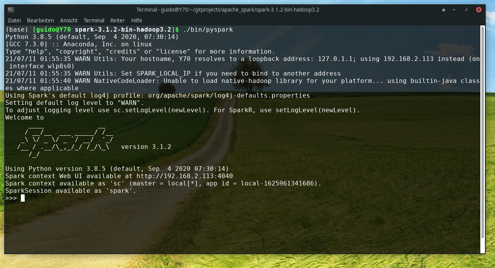

* cd to local directory
```
cd gitprojects/apache_spark/spark-3.1.2-bin-hadoop3.2/
```
* run spark-shell for screenshot --> 
```
./bin/pyspark
```
* run spark_word_count.py and write output in  
```
./bin/spark-submit /home/guido/gitprojects/datascience/aufg_13/spark_word_count.py > spark_word_count_log.txt
```
# Most used word is **the**